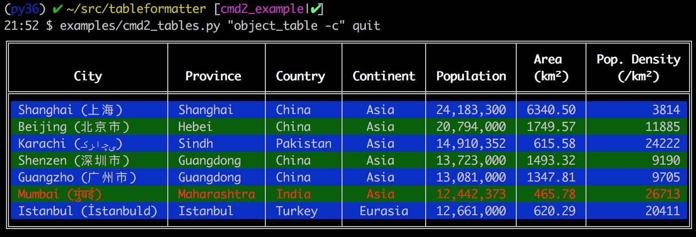

# tableformatter: tabular data formatter
[](https://pypi.org/project/tableformatter/)
[](https://travis-ci.com/python-tableformatter/tableformatter)
[](https://ci.appveyor.com/project/anselor/tableformatter)
[](https://dev.azure.com/python-tableformatter/tableformatter/_build/latest?definitionId=1&branch=master)
[](https://codecov.io/gh/python-tableformatter/tableformatter)

tableformatter is a tabular data formatter allowing printing from both arbitrary tuples of strings or object inspection.
It converts your data into a string form suitable for pretty-printing as a table.  The goal is to make it quick and easy
for developers to display tabular data in an aesthetically pleasing fashion.  It provides a simple public API, but allows
fine-grained control over almost every aspect of how the data is formatted.

Many other modules for formatting tabular data require the developer to create a transition layer to convert their
objects/data into a structure the formatter can consume.  One relatively novel aspect of tableformatter is the ability to directly
receive arbitrary Python objects.

[](https://github.com/python-tableformatter/tableformatter/blob/master/tf.png)


## Main Features
- Easy to display simple tables with just one function call when you don't need the fine-grained control
- Fine-grained control of almost every aspect of how data is formatted when you want it
- Tables with column headers
- Flexible grid style
- Transposed tables with rows and columns swapped
- Colored output using either [colorama](https://github.com/tartley/colorama) or [colored](https://github.com/dslackw/colored)
- Good unicode support including for characters which are more than 1 visual character wide
- Support for Python 3.4+ on Windows, macOS, and Linux


## Installation
```Bash
pip install tableformatter
```


## Dependencies
``tableformatter`` depends on the [wcwidth](https://github.com/jquast/wcwidth) module for measuring the width of
unicode strings rendered to a terminal.

If you wish to use the optional support for color, then at least one of the following two modules must be installed:
* [colorama](https://github.com/tartley/colorama) - simple cross-platform colored terminal text with about 16 colors
* [colored](https://github.com/dslackw/colored) - library for color in terminal with 256 colors, macOS and Linux only

If both ``colorama`` and ``colored`` are installed, then ``colored`` will take precedence.


## Usage
For simple cases, you only need to use a single function from this module: ``generate_table``.  The only required argument
to this function is ``rows`` which is an Iterable of Iterables such as a list of lists or another tabular data type like
a 2D [numpy](http://www.numpy.org) array.  ``generate_table`` outputs a nicely formatted table:

```Python
import tableformatter as tf

rows = [('A1', 'A2', 'A3', 'A4'),
        ('B1', 'B2\nB2\nB2', 'B3', 'B4'),
        ('C1', 'C2', 'C3', 'C4'),
        ('D1', 'D2', 'D3', 'D4')]
print(tf.generate_table(rows))
╔════╤════╤════╤════╗
║ A1 │ A2 │ A3 │ A4 ║
║ B1 │ B2 │ B3 │ B4 ║
║    │ B2 │    │    ║
║    │ B2 │    │    ║
║ C1 │ C2 │ C3 │ C4 ║
║ D1 │ D2 │ D3 │ D4 ║
╚════╧════╧════╧════╝
```

*NOTE: Rendering of tables looks much better in Python than it appears in this Markdown file.*

See the [simple_text.py](https://github.com/python-tableformatter/tableformatter/blob/master/examples/simple_text.py) and
[simple_object.py](https://github.com/python-tableformatter/tableformatter/blob/master/examples/simple_object.py) examples
for more basic usage.

## Supported Data Types
The following tabular data types are supported:
* list of lists or another iterable of iterables
* two-dimensional NumPy arrays
* NumPy record arrays (names as columns)
* pandas.DataFrame
* list or another iterable of arbitrary non-iterable objects (column specifier required) 
* list or another iterable of dicts (dict keys iterated through as rows where each key must be a hashable iterable)
* dict of iterables (keys as columns)

See the [data_types.py](https://github.com/python-tableformatter/tableformatter/blob/master/examples/data_types.py) 
example for more info.


## Column Headers
The second argument to ``generate_table`` named ``columns`` is optional and defines a list of column headers to be used.

```Python
cols = ['Col1', 'Col2', 'Col3', 'Col4']
print(tf.generate_table(rows, cols))
╔══════╤══════╤══════╤══════╗
║ Col1 │ Col2 │ Col3 │ Col4 ║
╠══════╪══════╪══════╪══════╣
║ A1   │ A2   │ A3   │ A4   ║
║ B1   │ B2   │ B3   │ B4   ║
║      │ B2   │      │      ║
║      │ B2   │      │      ║
║ C1   │ C2   │ C3   │ C4   ║
║ D1   │ D2   │ D3   │ D4   ║
╚══════╧══════╧══════╧══════╝
```

## Grid Style
The third argument to ``generated`` table named ``grid_style`` is optional and specifies how the table lines are drawn.

Supported grid sytles are:

* **AlternatingRowGrid** - generates alternating black/gray background colors for rows to conserve vertical space (defalt)
* **FancyGrid** - fancy table with grid lines dividing rows and columns
* **SparseGrid** - sparse grid with no lines at all to conserve both vertical and horizontal space

```Python
print(tf.generate_table(rows, grid_style=tf.FancyGrid()))
╔════╤════╤════╤════╗
║ A1 │ A2 │ A3 │ A4 ║
╟────┼────┼────┼────╢
║ B1 │ B2 │ B3 │ B4 ║
║    │ B2 │    │    ║
║    │ B2 │    │    ║
╟────┼────┼────┼────╢
║ C1 │ C2 │ C3 │ C4 ║
╟────┼────┼────┼────╢
║ D1 │ D2 │ D3 │ D4 ║
╚════╧════╧════╧════╝
```


## Transposed Tables
Normally the "rows" are displayed left-to-right and "columns" are displayed up-to-down.  However, if you want to transpose
this and print "rows" up-to-down and "columns" left-to-right then that is easily done using the fourth (optional) argument
to ``generate_table``:

```Python
print(tf.generate_table(rows, cols, transpose=True))
╔══════╦════╤════╤════╤════╗
║ Col1 ║ A1 │ B1 │ C1 │ D1 ║
║ Col2 ║ A2 │ B2 │ C2 │ D2 ║
║      ║    │ B2 │    │    ║
║      ║    │ B2 │    │    ║
║ Col3 ║ A3 │ B3 │ C3 │ D3 ║
║ Col4 ║ A4 │ B4 │ C4 │ D4 ║
╚══════╩════╧════╧════╧════╝
```


## Column Formatting
For rich column formatting, instead of passing a simple iterable to the 2nd argument of ``generate_table``, an iterable
of ``tableformatter.Column`` objects can be passed.  The ``Column`` class has the following attributes, all of which are
optional other than the first:

| Attribute name | Description |
| -------------- | ----------- |
| col_name       | Column name to display
| width          | Number of displayed terminal characters. Unicode wide characters count as 2 displayed characters.
| attrib         | The name of the object attribute to look up for cell contents on this column
| wrap_mode      | Defines how to handle long cells that must be wrapped or truncated
| wrap_prefix    | String to display at the beginning of each wrapped line in a cell
| cell_padding   | Number of padding spaces to the left and right of each cell
| header_halign  | Horizontal alignment of the column header
| header_valign  | Vertical alignment of the column header
| cell_halign    | Horizontal alignment of the cells in this column
| cell_valign    | Vertical alignment of the cells in this column
| formatter      | Callable that can process the value in this column for display
| obj_formatter  | Callable that processes the row object to generate content for this column

See the [columns.py](https://github.com/python-tableformatter/tableformatter/blob/master/examples/columns.py) example
for a demonstration for how all of these options can be used.

### Column Alignment
You can override both the horizontal and vertical alignment.  This can be done separately for the column header versus
the cell contents.

Possible alignments are all elements within the ``ColumnAlignment`` enum class: 
* Horizontal alignments:
    * AlignLeft (*default*)
    * AlignCenter
    * AlignRight
* Vertical alignments:
    * AlignTop (*default*)
    * AlignBottom
    
```Python
columns = (tf.Column('Col1', cell_halign=tf.ColumnAlignment.AlignLeft),
           tf.Column('Col2', cell_halign=tf.ColumnAlignment.AlignRight),
           tf.Column('Col3', cell_halign=tf.ColumnAlignment.AlignCenter),
           tf.Column('Col4', cell_valign=tf.ColumnAlignment.AlignBottom))
print(tf.generate_table(rows, columns))
╔══════╤══════╤══════╤══════╗
║ Col1 │ Col2 │ Col3 │ col4 ║
╠══════╪══════╪══════╪══════╣
║ A1   │   A2 │  A3  │ A4   ║
║ B1   │   B2 │  B3  │      ║
║      │   B2 │      │      ║
║      │   B2 │      │ B4   ║
║ C1   │   C2 │  C3  │ C4   ║
║ D1   │   D2 │  D3  │ D4   ║
╚══════╧══════╧══════╧══════╝
```    
   
### Number Formatting
The ``formatter`` attribute of the ``Column`` class accepts an arbitrary callable which accepts a single argument containing
the cell contents for that column and returns a string with the contents formatted in the
desired format.  There are a couple callable classes built into ``tableformatter`` to help
formatting numbers:
* FormatBytes - formats a value in bytes into a human readable string
* FormatCommas - Formats a number with comma separators

```Python
rows = [(None, None),
        ('123', '123'),
        (123, 123),
        (12345, 12345),
        (12345678, 12345678),
        (1234567890, 1234567890),
        (1234567890123, 1234567890123)]
cols = (tf.Column('First', width=20, formatter=tf.FormatBytes(), cell_halign=tf.ColumnAlignment.AlignRight),
        tf.Column('Second', formatter=tf.FormatCommas(), cell_halign=tf.ColumnAlignment.AlignRight))
print(tf.generate_table(rows, cols))
╔═══════════╤═══════════════════╗
║ First     │ Second            ║
╠═══════════╪═══════════════════╣
║           │                   ║
║ 123.00  B │               123 ║
║ 123.00  B │               123 ║
║  12.06 KB │            12,345 ║
║  11.77 MB │        12,345,678 ║
║   1.15 GB │     1,234,567,890 ║
║   1.12 TB │ 1,234,567,890,123 ║
╚═══════════╧═══════════════════╝
```

See the [cmd2_tables.py](https://github.com/python-tableformatter/tableformatter/blob/master/examples/formatters.py) example
for examples of how custom formatter functions can be used.


## Color
If either ``colorama`` or ``colored`` is installed, then ``tableformatter`` has support for altering both the foreground
and background color of cell contents.

### Alternating background row color
It is trivial to alternate the background color of each row as follows:
```Python
from colorama import Back
print(generate_table(rows, cols, grid_style=tf.AlternatingRowGrid(Back.GREEN, Back.BLUE)))
```
See the [cmd2_tables.py](https://github.com/python-tableformatter/tableformatter/blob/master/examples/cmd2_tables.py) or 
[color.py](https://github.com/python-tableformatter/tableformatter/blob/master/examples/color.py) examples for more 
complete examples.

### Dynamically setting cell color based on cell contents
The 5th argument to ``generate_table`` is **row_tagger** and it expects a callable which accepts a single argument for
the row contents and returns a dictionary of row options for that row which can
be used to set the foreground and/or background color of all cells in that row.

See the ``high_density_tuples`` function in the [cmd2_tables.py](https://github.com/python-tableformatter/tableformatter/blob/master/examples/cmd2_tables.py)
example for a demonstration of how to use this feature.


